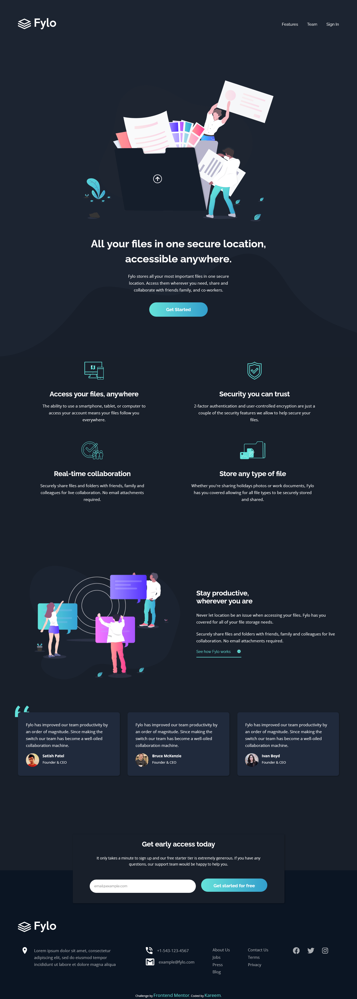

# Frontend Mentor - Fylo dark theme landing page solution

This is a solution to the [Fylo dark theme landing page challenge on Frontend Mentor](https://www.frontendmentor.io/challenges/fylo-dark-theme-landing-page-5ca5f2d21e82137ec91a50fd). Frontend Mentor challenges help you improve your coding skills by building realistic projects.

## Table of contents

- [Overview](#overview)
  - [The challenge](#the-challenge)
  - [Screenshot](#screenshot)
  - [Links](#links)
- [My process](#my-process)
  - [Built with](#built-with)
  - [What I learned](#what-i-learned)
  - [Continued development](#continued-development)
  - [Useful resources](#useful-resources)
- [Author](#author)
- [Acknowledgments](#acknowledgments)

## Overview

### The challenge

Users should be able to:

- View the optimal layout for the site depending on their device's screen size
- See hover states for all interactive elements on the page

### Screenshot

### Links

- Solution URL: [Add solution URL here](https://your-solution-url.com)
- Live Site URL: [Add live site URL here](https://your-live-site-url.com)

## My process

### Built with

- Semantic HTML5 markup
- CSS custom properties
- Flexbox
- CSS Grid
- Mobile-first workflow

### What I learned

Taking time to figure out the html structure is important in building a webpage.

### Continued development

To keep on practicing.

### Useful resources

- [Example resource 1](https://www.stackoverflow.com) - It saves developer's lives.

## Author

- Frontend Mentor - [@yourusername](https://www.frontendmentor.io/profile/talentlessDeveloper)
- Twitter - [@yourusername](https://www.twitter.com/kcreeem)

## Acknowledgments

To everyone contributing to open source and making sure knowledge is free and open to all, you guys are heroes! Big ups to frontend mentor for this opportunity.
